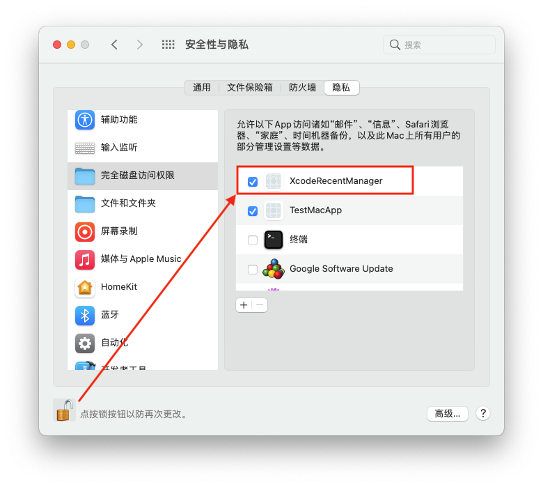

# XcodeRecentManager
Xcode Recent Items Manager Xcode 最近打开文件列表管理工具    
Mac app store 已经上线，由于沙盒限制，操作略显繁琐，需要授权两个文件夹  
1、历史记录文件夹。  
2、工程所在文件夹，一般建议在用户目录下创建Developer(所有工程都放在这里面)，然后拖到Finder侧边栏，这样还有个小锤子呢    

Mac app store :  https://apps.apple.com/cn/app/xcoderecentmanager/id6474598237

`~/Library/Application Support/com.apple.sharedfilelist/com.apple.LSSharedFileList.ApplicationRecentDocuments/com.apple.dt.xcode.sfl2`
1.  从以上路径读取Xcode的最近打开文件列表，然后用`UITableView`显示，点击打开。  
2. 用`MacTask.bundle`的方法读取git分支信息，并显示。  

